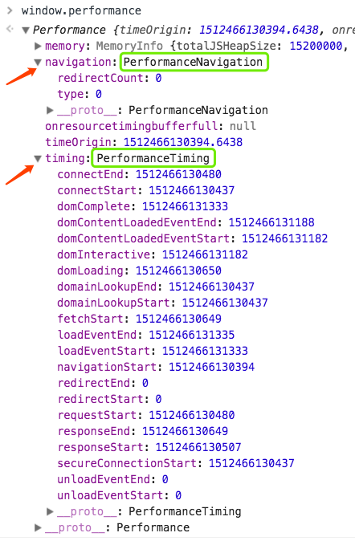

# Performance API

## 介绍

High Resolution Time 标准定义了 [Performance](https://developer.mozilla.org/en-US/docs/Web/API/Performance) 接口，利用该接口可以在应用程序的客户端测量延迟。该接口之所以叫 high resolution，是因为它能精确到千分之一毫秒。Performance API 定义了一个 [DOMHighResTimeStamp](https://developer.mozilla.org/en-US/docs/Web/API/DOMHighResTimeStamp) 类型，而没用 [Date.now()](https://developer.mozilla.org/en-US/docs/Web/JavaScript/Reference/Global_Objects/Date/now) 接口。

即`window.performance`

它有两个方法：
- `now()`：返回一个 DOMHighResTimeStamp，其值取决于 navigation start 和 scope（可以是 window/worker）
- `toJSON()`：返回 Performance 对象的 JSON 格式

两个属性：
- `navigation`：用户是如何导航到此页面的，类型是 [PerformanceNavigation](https://developer.mozilla.org/en-US/docs/Web/API/PerformanceNavigation)
- `timing`：页面的加载数据，类型是 [PerformanceTiming](https://developer.mozilla.org/en-US/docs/Web/API/PerformanceTiming)





## DOMHighResTimeStamp

之前在内联脚本里用 `Data.now()` 测量性能是有局限性的，且不可靠。原因有：
- 统计代码在页面里，它本身会影响页面的加载，进而影响统计到的时间（Navigation Timing API 可以在页面加载完毕之后执行的，不影响进程）
- [JS 的时间是不精确的](https://johnresig.com/blog/accuracy-of-javascript-time/)
- 不能计算网络延时，诸如DNS解析、重定向、服务器返回


```javascript
var myTime = window.performance.now();
```

## [PerformanceNavigation](https://www.w3.org/TR/navigation-timing/#performancenavigation) 接口

两个属性
1. `type` 只读，表示页面是怎么导航过来的
    - 0 新打开，包括通过链接导航来、书签栏、表单提交、脚本、或者在地址栏输入 url
    - 1 重新加载，通过点击 Reload 按钮，或者 `Location.reload()` 方法
    - 2 历史记录，点击后退按钮
    - 255 其他情况
2. `redirectCount` 只读，在拿到页面之前被重定向的次数


## [PerformanceTiming](https://www.w3.org/TR/navigation-timing/#sec-navigation-timing-interface) 接口

下面介绍下各个时间的含义

> [processing model](https://www.w3.org/TR/navigation-timing/#processing-model)


1. `navigationStart` 在用户代理完成[提示卸载](https://www.w3.org/TR/html5/browsers.html#prompt-to-unload-a-document)之前的文档后，返回的时间；若无之前文档，则其值同`fetchStart`
2. `redirectStart` 如果有HTTP重定向，或所有重定向来自同源，则它返回 `fetchStart`的时间；否则，返回0
3. `unloadEventStart` 如果之前的文档和当前文档是同域，开始卸载之前文档之前；如果没有之前文档/不同域，则返回0
4. `unloadEventEnd` 果之前的文档和当前文档是同域，完成卸载之前文档之后；如果没有之前文档/不同域/卸载未完成，则返回0
5. `redirectEnd` 如果有HTTP重定向，或所有重定向来自同源，则它返回的是收到最后一次重定向的响应的最后一个字节后的时间；否则，返回0
6. `fetchStart` 如果是 HTTP GET，则是在检查所有 app cache 之前；否则是开始fecth资源时的时间
7. `domainLookupStart` 开始域名解析之前；若不需要域名解析，则值`fetchStart`
8. `domainLookupEnd` 域名解析完毕之后；若不需要域名解析，则值同 `fetchStart`  _此部分非规范性的_
9. `connectStart` 开始建立连接之前
10. `secureConnectionStart` 可选的
    - 不具有此属性的，则值是`undefined`
    - 若此属性可用：HTTPS协议时，用户代理开始握手之前；若未使用HTTPS，则值是0
11. `connectEnd` 连接建立好之后
    - 若是个持久性连接/从程序缓存取/本地资源，则其值同 `domainLookupEnd`
    - 它包含建立连接的其他时间，比如SSL握手、SOCKS身份验证
    - 如果连接失败，重新开始连接，则`connectStart`和`connectEnd`是返回新连接的值
12. `requestStart` 开始请求文档之前 _此接口不包含`requestEnd`_
13. `responseStart` TTFB之后
14. `responseEnd` 拿到最后一个字节之后
15. `domLoading` 在将文档设置为 loading 之前
16. `domInteractive` 在将文档设置为 interactive 之前
17. `domContentLoadedStart` 触发 DOMContentLoaded 事件之前
18. `domContentLoadedEnd` 触发 DOMContentLoaded 事件之后
19. `domComplete` 返回把当前文档设置为complete之前的时间；第一次
20. `loadEventStart` 返回load事件触发之前的时间；若load事件没触发，则返回0
21. `loadEventEnd`  返回load事件完成的时间；若load事件没触发/没完成，则返回0


## 如何使用
### 获取当前页面

直接访问 `window.performance.timing` 通过计算便可得到具体的时间。eg.

- 网络延时 `responseEnd-fetchStart`
- TTFB `loadEventEnd-responseEnd`
- 导航和页面的加载时长 `loadEventEnd-navigationStart`
- 重定向的花费时长

为了不影响当前页面的加载

```
window.onload = function(){
  setTimeout(function(){
    var t = performance.timing;
    console.log(t.loadEventEnd - t.responseEnd);
  }, 0);
}
```

### [User Timing](https://www.w3.org/TR/user-timing/) 接口
`window.performance` 接口之所以灵活，是因为它是个可编程。可以在不影响当前用户页面加载的情况下使用。

- 提供了函数，在应用程序的不同地方调用
    - `mark()` 为我们存储一个时间戳，指定个名字  `window.performance.mark('mark_fully_loaded');`
    - `measure()` 计算时间   *名字也可以是PerformanceTiming中的任何时间*
    - `clearMarks()`
    - `clearMeasures()`
- 获取时间数据，用接口 [PerformanceTimeline](https://www.w3.org/TR/performance-timeline/#sec-performance-timeline)
    - `getEntriesByType('mark|measure')` 可获取所有的 mark 和 measure 数据
    - `getEntriesByName()`